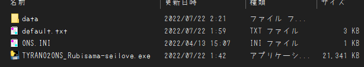

# TYRANO2ONS_Rubisama-seilove
⚠必ず注意事項を読んでください⚠
## なにこれ
  2022年に[るび様を崇める会](https://rubisama.com/)から発売された、18禁PC向けノベルゲーム'[セイラに夢みたいないちゃラブご奉仕させていただけますか](https://rubisama.com/seira/)'を 
  ONScripter形式へ変換するためのコンバータです 

## 再現度
原作との違いは主に以下
 - ゲーム進行時のUIはすべて未実装 
   セーブ等は右クリックで行う仕様
 - ゲーム終了時の操作が少々特殊 
   (環境設定→終了する)
 - タイトル画面のCGがランダムではなく固定
 - キャラ移動/一部エフェクト/可変文字未実装
 - コンフィグ/CG/回想未実装
 - **エンディング未実装**
 - その他細かいバグ有り(?)

v0.7.2現在ではとりあえず最後まで読めるだけ、な状態です

## 使い方
※事前に[ffmpegのパスを通して](https://www.google.com/search?q=ffmpeg+%E3%83%91%E3%82%B9+%E9%80%9A%E3%81%99+windows)ください

 1. 専用ツールを利用して"resources/app.asar"を展開します 
    (筆者は[Asar7z](https://www.google.com/search?q=Asar7z)を利用しました)

 2. 適当な作業フォルダを作成し、展開したasar内の"data"フォルダを移動させます

 3. 展開先のディレクトリで[このコンバータ](https://github.com/Prince-of-sea/TYRANO2ONS_Rubisama-seilove/releases/latest)をDL 

 4. 起動させ変換(最低でも数分程度はかかります) 
    変換前の時点で以下のような構成になっていればOKです↓ 
     
    **※"PSP向け以外に変換する場合、ここで"ONS.INI"を削除してください** 
    **削除しなかった場合、そのままPSP向けに変換されます** 

 5. ウィンドウが消え、0.txtができれば完成 
    変換済みファイルと共に利用ハードへ転送

## 注意事項
 - 当然ですが公式ツールではありません
 - DLSite DL版、2022/8/9時点での最新バージョンで動作確認しています
 - 本ツールの使用において生じた問題や不利益などについて、作者は一切の責任を負いません
 - 制作サークル様に迷惑をかけたくないので、 
   本ツールのSNS等での拡散は**ご遠慮ください** 
   ~~(拡散されるほどのツールでもない気はするが一応)~~ 

